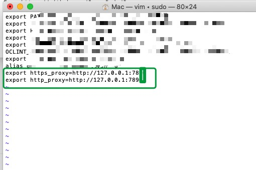

本方案用于解决包括但不限于以下问题：

- 通用
	- 在终端使用 `git clone` 拉代码便秘；

- **iOS** 开发者
	- `pod install` / `pod setup` 极其慢；

- **JavaScript** 开发者
	- `npm install` 屡次卡住及失败；
	- `yarn` 同上；

以上问题基本上是初级开发者经常会遇到的问题，常见于各大技术交流群中，屡次有人提起，屡次有人提起，屡次有人提起。

以至于，忍无可忍，无需再忍！

## 方案

在此给出彻底的解决方案：

- 首先，你需要购买一个科学上网（**需要支持 http 端口代理**）；
  - `macOS` 客户端：
  	- 如果使用的是 **ClashX** ，点击菜单，选择 `复制终端代理命令`，然后拷贝到终端即可。

如图所示

  	- 如果使用的是 **ShadowsocksX-NG**，点击菜单，选择 `复制终端代理命令`，然后拷贝到终端即可。

如图所示

  	> 没错，这2个 APP 都有这个命令；如果没有，请更新最新版本。

  - `Windows` 客户端：

    - 暂时没 Windows 系统…

通过以上步骤，已经能够解决无法下载、下载失败等问题，
下载速度应该有个几兆/秒了(依赖你的科学上网提供方服务器和你的网速)：

但是复制的 `export http_proxy...` 命令，只能在当前终端窗口生效，新开一个窗口或者重启后就无效了，需要再次复制到终端。

所以，以下步骤将 **export http_proxy...** 命令写入终端配置文件中，一劳永逸。

## Terminal

如果你使用的是 macOS 系统的 Terminal 终端，按以下步骤操作：

- 执行 `sudo vi ~/.bash_profile` 打开配置文件，将你从上文复制的命令拷贝到末尾；

  > 如果不存在 `~/.bash_profile` ，使用 `touch ~/.bash_profile` 创建。

- 执行 `source ~/.bash_profile`  ，使配置文件生效。

  > source 命令通常用于重新执行刚修改的初始化文件，使之立即生效。
- 重新打开一个 Terminal 窗口，使用 `env | grep -i proxy` 命令，此时终端应该输出以下内容：

- 我的配置如下：

## iterm2

如果你也使用的 macOS 系统 [iterm2](https://www.iterm2.com) (推荐)，参考以下操作：

- 执行 `sudo vi ~/.zshrc` 打开配置文件，将你从上文复制的命令拷贝到末尾；

- 执行 `source ~/.zshrc`，使配置文件生效。
- 重新打开一个 iterm2 窗口，使用 `env | grep -i proxy` 命令，此时终端应该输出： 

---

我说完了。
